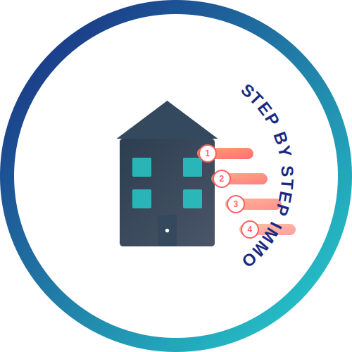

<div align="center">
  
  <h1 style="display: inline-block; vertical-align: middle;">Step by Step Immo</h1>
</div><br>

> Construis ton projet immobilier en Afrique et dans la diaspora, étape par étape.

## 📌 Aperçu du Projet

**Step by Step Immo** est une plateforme complète basée sur Python qui offre un accompagnement structuré pour les projets immobiliers en Afrique. La plateforme permet aux utilisateurs de décomposer leurs projets en étapes gérables, de suivre leur progression et de se connecter avec des prestataires de services vérifiés.

### ✨ Fonctionnalités Clés

- **Gestion de Projet Structurée :** Créez et organisez vos projets immobiliers en étapes séquentielles
- **Suivi de Progression :** Surveillez l'avancement du projet avec des indicateurs visuels
- **Gestion Budgétaire :** Suivez l'allocation et les dépenses budgétaires à travers les étapes du projet
- **Répertoire de Prestataires :** Connectez-vous avec des professionnels de confiance pour chaque phase du projet
- **Support Multi-pays :** Initialement concentré sur le Cameroun et le Canada avec des plans d'expansion

## 🚀 Démarrage Rapide

### Prérequis

- Python 3.10+
- Base de données PostgreSQL
- Poetry pour la gestion des dépendances

### Installation

```bash
# Cloner le dépôt
git clone https://github.com/Hugues-DTANKOUO/step-by-step-immo.git
cd step-by-step-immo

# Installer les dépendances
poetry install

# Configurer les variables d'environnement
cp .env.example .env
# Éditer .env avec vos paramètres de base de données et d'application

# Initialiser la base de données
poetry run alembic upgrade head

# Lancer le serveur de développement
poetry run server
```

### Accéder à l'Application

Visitez [http://127.0.0.1:8000](http://127.0.0.1:8000) dans votre navigateur.

## 🔧 Stack Technologique

- **Backend :**
  - Python 3.10+
  - FastAPI pour le framework web
  - SQLAlchemy pour l'ORM
  - Alembic pour les migrations de base de données
  - PostgreSQL pour la base de données

- **Frontend :**
  - HTML/CSS avec templates Jinja2
  - JavaScript pour l'interactivité
  - Design responsive personnalisé

- **Outils de Développement :**
  - Poetry pour la gestion des dépendances
  - Ruff pour le linting
  - MyPy pour la vérification des types


## 🌟 Fonctionnalités Principales

### 1. Gestion de Projet
- Création et suivi de projets immobiliers
- Décomposition des projets en étapes séquentielles
- Allocation de budget entre différentes étapes
- Suivi de la progression avec indicateurs visuels

### 2. Système Utilisateur
- Inscription et authentification des utilisateurs
- Contrôle d'accès basé sur les rôles
- Gestion de profil
- Système de permissions

### 3. Prestataires de Services
- Répertoire de professionnels vérifiés
- Catégorisation des services
- Connexion avec les étapes du projet
- Système d'évaluation et de commentaires

### 4. Plans d'Abonnement
- Niveau gratuit avec fonctionnalités de base
- Plans premium avec capacités avancées
- Traitement sécurisé des paiements
- Gestion des abonnements

## 👥 Public Cible

- **Particuliers :** Personnes cherchant à construire ou acheter une propriété en Afrique
- **Membres de la Diaspora :** Personnes gérant des projets immobiliers à distance
- **Professionnels de l'Immobilier :** Agents, entrepreneurs et prestataires de services
- **Investisseurs :** Personnes cherchant à investir dans l'immobilier africain

## 🧑‍💻 Développement

### Exécution des Vérifications

```bash
# Exécuter toutes les vérifications (linting, vérification des types, tests)
poetry run check

# Exécuter uniquement les tests
poetry run tests

# Exécuter uniquement le linting
poetry run lint
```

### Migration de la Base de Données

```bash
# Créer une nouvelle migration
poetry run alembic revision --autogenerate -m "Description des changements"

# Appliquer les migrations
poetry run alembic upgrade head
```

## 🤝 Contribution

Les contributions sont les bienvenues ! N'hésitez pas à soumettre une Pull Request.

1. Forkez le dépôt
2. Créez votre branche de fonctionnalité (`git checkout -b fonctionnalite/fonctionnalite-incroyable`)
3. Committez vos changements (`git commit -m 'Ajout d'une fonctionnalité incroyable'`)
4. Poussez vers la branche (`git push origin fonctionnalite/fonctionnalite-incroyable`)
5. Ouvrez une Pull Request

## 📄 Licence

Ce projet est sous licence MIT - voir le fichier [LICENSE](LICENSE) pour plus de détails.

## 🧑‍💻 À Propos de l'Auteur

Maintenu par **Hugues Dtankouo**, Développeur Full Stack Senior.

📧 **Contact :** [huguesdtankouo@gmail.com](mailto:huguesdtankouo@gmail.com)  
🔗 **LinkedIn :** [Hugues Dtankouo](https://www.linkedin.com/in/dtankouo)  
🔗 **GitHub :** [Hugues-DTANKOUO](https://github.com/Hugues-DTANKOUO)

## 🚧 État du Projet

Ce projet est activement en développement. Les domaines d'intérêt actuels sont :
1. Amélioration de l'interface utilisateur
2. Expansion du réseau de prestataires de services
3. Ajout de nouveaux pays d'opération
4. Implémentation d'analyses avancées

## 📞 Support

Pour obtenir de l'aide, veuillez envoyer un email à [huguesdtankouo@gmail.com](mailto:huguesdtankouo@gmail.com).