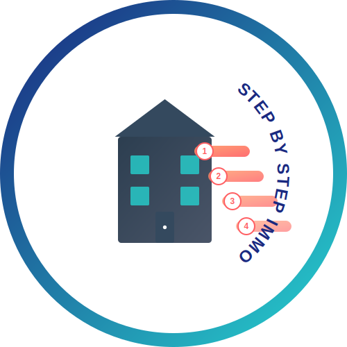

<div align="center">
  
  <h1 style="display: inline-block; vertical-align: middle;">Step by Step Immo</h1>
</div><br>

[](LICENSE)
[](https://www.python.org/downloads/)
[](https://github.com/astral-sh/ruff)

> Building your real estate projects in Africa and the diaspora, one step at a time.

## 📌 Project Overview

**Step by Step Immo** is a comprehensive Python-based platform that provides structured guidance for real estate projects in Africa. The platform enables users to break down their projects into manageable steps, track progress, and connect with verified service providers.

### ✨ Key Features

- **Structured Project Management:** Create and organize real estate projects into sequential steps
- **Progress Tracking:** Monitor project advancement with visual indicators
- **Budget Management:** Track budget allocation and spending across project steps
- **Service Provider Directory:** Connect with trusted professionals for each project phase
- **Multi-country Support:** Initially focused on Cameroon and Canada with plans for expansion

## 🚀 Getting Started

### Prerequisites

- Python 3.10+
- PostgreSQL database
- Poetry for dependency management

### Installation

```bash
# Clone the repository
git clone https://github.com/Hugues-DTANKOUO/step-by-step-immo.git
cd step-by-step-immo

# Install dependencies
poetry install

# Configure environment variables
cp .env.example .env
# Edit .env with your database and application settings

# Initialize the database
poetry run alembic upgrade head

# Run the development server
poetry run server
```

### Access the Application

Visit [http://127.0.0.1:8000](http://127.0.0.1:8000) in your browser.

## 🔧 Technology Stack

- **Backend:**
  - Python 3.10+
  - FastAPI for the web framework
  - SQLAlchemy for ORM
  - Alembic for database migrations
  - PostgreSQL for database

- **Frontend:**
  - HTML/CSS with Jinja2 templates
  - JavaScript for interactivity
  - Custom responsive design

- **Development Tools:**
  - Poetry for dependency management
  - Ruff for linting
  - MyPy for type checking


## 🌟 Core Features

### 1. Project Management
- Create and track real estate projects
- Break down projects into sequential steps
- Allocate budget across different steps
- Monitor progress with visual indicators

### 2. User System
- User registration and authentication
- Role-based access control
- Profile management
- Permission system

### 3. Service Providers
- Directory of verified professionals
- Service categorization
- Connection with project steps
- Rating and review system

### 4. Subscription Plans
- Free tier with basic features
- Premium plans with advanced capabilities
- Secure payment processing
- Subscription management

## 👥 Target Audience

- **Individuals:** People looking to build or buy property in Africa
- **Diaspora Members:** Those managing remote real estate projects
- **Real Estate Professionals:** Agents, contractors, and service providers
- **Investors:** Individuals looking to invest in African real estate

## 🧑‍💻 Development

### Running Checks

```bash
# Run all checks (linting, type checking, tests)
poetry run check

# Run only tests
poetry run tests

# Run only linting
poetry run lint
```

### Database Migration

```bash
# Create a new migration
poetry run alembic revision --autogenerate -m "Description of changes"

# Apply migrations
poetry run alembic upgrade head
```

## 🤝 Contributing

Contributions are welcome! Please feel free to submit a Pull Request.

1. Fork the repository
2. Create your feature branch (`git checkout -b feature/amazing-feature`)
3. Commit your changes (`git commit -m 'Add some amazing feature'`)
4. Push to the branch (`git push origin feature/amazing-feature`)
5. Open a Pull Request

## 📄 License

This project is licensed under the MIT License - see the [LICENSE](LICENSE) file for details.

## 🧑‍💻 About the Author

Maintained by **Hugues Dtankouo**, a Senior Full Stack Developer.

📧 **Contact:** [huguesdtankouo@gmail.com](mailto:huguesdtankouo@gmail.com)  
🔗 **LinkedIn:** [Hugues Dtankouo](https://www.linkedin.com/in/dtankouo)  
🔗 **GitHub:** [Hugues-DTANKOUO](https://github.com/Hugues-DTANKOUO)

## 🚧 Project Status

This project is actively under development. Current focus areas:
1. Enhancing the user interface
2. Expanding service provider network
3. Adding more countries of operation
4. Implementing advanced analytics

## 📞 Support

For support, please email [huguesdtankouo@gmail.com](mailto:huguesdtankouo@gmail.com).